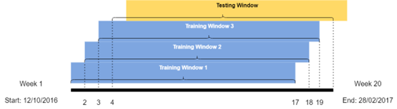
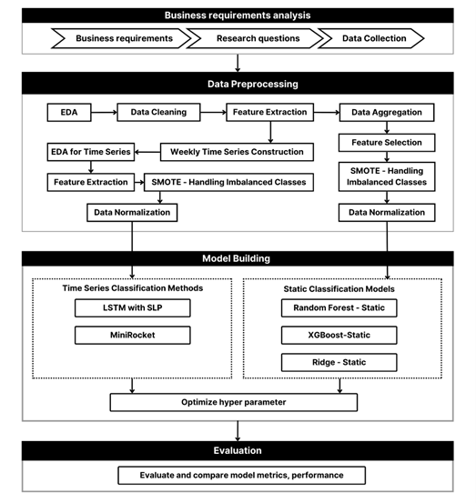

 **A Dynamic Approach to Churn Prediction Using Time Series Classification**

### Authors:
- Si Dan Tran¹²
- Duy Duan Nguyen¹²
- Thuy Vy Nguyen¹²
- Thi Kim Hien Le¹² (*Corresponding author: hienltk@uel.edu.vn)*

¹University of Economics and Law, Ho Chi Minh City, Vietnam  
²Vietnam National University, Ho Chi Minh City, Vietnam

---

## Abstract:
This paper addresses the challenge of predicting customer churn using time series classification models that capture the dynamic nature of customer behavior. The proposed models, MINIROCKET and LSTM-SLP, outperform traditional static models (Random Forest, XGBoost, Ridge Regression) in churn prediction accuracy. By utilizing weekly time series data, the research emphasizes the importance of temporal dynamics in predicting churn and proposes a flexible approach that adapts to rapid behavioral changes.

---

## Keywords:
- Churn prediction  
- Time series classification  
- Deep learning  
- MINIROCKET  
- Dynamic behavior  

---

## Data Source:
The data used was introduced at the **11th ACM International Conference on Web Search and Data Mining (Y. Chen, Xie, Lin, & Chiu, 2018)**, containing churn customer data from the online subscription music platform **KKBOX**. The dataset includes three characteristic groups:  
- **Listening behavior of customers**  
- **Demographics of customers**  
- **Transaction history of customers**

The data used for training and testing the model's effectiveness was sampled over the period from **October 12, 2016, to February 28, 2017**, corresponding to 20-week time series data with each time step equivalent to 1 week. The time frames were created using the “sliding window” algorithm, resulting in the following windows:
- Training Window 1  
- Training Window 2  
- Training Window 3  
- Testing Window  

---

## Methodology:

### Input Features:  
The following 14 features were used for input, emphasizing both static and dynamic nature:
- **num_25**: Number of songs played for less than 25% of their length.
- **num_50**: Number of songs played between 25% and 50% of their length.
- **num_75**: Number of songs played between 50% and 75% of their length.
- **num_985**: Number of songs played between 75% and 98.5% of their length.
- **num_100**: Number of songs played for more than 98.5% of their length.
- **num_unq**: Number of unique songs played.
- **total_secs**: Total time spent listening to songs, measured in seconds.
- **actual_amount_paid**: Actual amount of money paid by the user.
- **diff_actual_plan_paid**: Difference between the actual amount paid and the planned amount.
- **make_cancellation**: Indicator of whether the user made a cancellation at the time.
- **city**: The city where the user resides.
- **age_group**: Age group classification of the user.
- **gender**: Gender of the user.
- **registered_via**: The method or platform through which the user registered.

### Data Preprocessing:
- **Outlier Handling**: The Interquartile Range (IQR) method was used to identify and remove outliers from the data.  
- **Feature Extraction**: New features were extracted to reduce dependence between existing features and highlight dynamic behaviors.  
- **Time Series Transformation**: Data was aggregated and transformed weekly to create multivariate time series, essential for accurate churn prediction.  

---

## Model Overview:
Two time series classification models were proposed:  
1. **MINIROCKET**: A time series classification model that uses a minimal random convolution kernel. It achieved high accuracy and computational efficiency.
2. **LSTM-SLP**: A hybrid model that combines Bidirectional Long Short-Term Memory (LSTM) and Single Layer Perceptron (SLP) to utilize both temporal and static features.

### Baseline Models for Comparison:
- Random Forest (Static)  
- XGBoost (Static)  
- Ridge Regression (Static)

---

## Model Evaluation Results:
| Model                | Precision | Accuracy | Recall | F1 Score | Log Loss |
|----------------------|-----------|----------|--------|----------|----------|
| **MINIROCKET**        | 0.82      | 0.95     | 0.77   | 0.79     | 1.74     |
| **LSTM-SLP**          | 0.74      | 0.94     | 0.80   | 0.76     | 1.95     |
| Random Forest - Static| 0.70      | 0.93     | 0.77   | 0.73     | 2.50     |
| XGBoost - Static      | 0.69      | 0.93     | 0.76   | 0.72     | 2.54     |
| Ridge Regression - Static| 0.77   | 0.94     | 0.51   | 0.50     | 2.04     |

---

## Results:
- **MINIROCKET** demonstrated the highest performance with an F1 score of 0.79, significantly outperforming static models.
- **LSTM-SLP** also showed superior results compared to traditional methods, with a 0.76 F1 score.
- Both time series models highlighted the importance of capturing dynamic changes in customer behavior for accurate churn prediction.

---

## Conclusion:
This research confirms that time series classification methods like MINIROCKET and LSTM-SLP can greatly improve churn prediction accuracy by considering temporal dynamics. The findings suggest that using weekly time series data allows for more timely customer retention strategies compared to static monthly models. Future work will focus on the development of explainable AI models like MINIROCKET-SHAP to enhance model transparency.

---

## License:
This project is licensed under the MIT License - see the [LICENSE](LICENSE) file for details.
